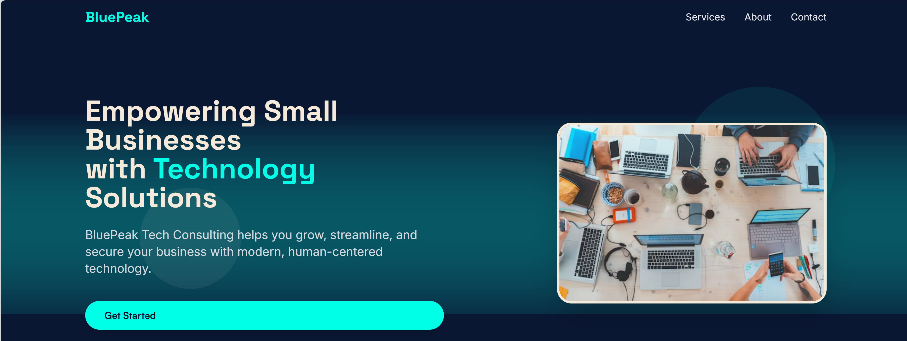

# BluePeak Tech Consulting Landing Page

A modern, fully responsive landing page template for a small business technology consulting company. Built with Tailwind CSS, custom fonts, and a clean, accessible design. Perfect for tech consultancies, agencies, or any professional services firm looking for a beautiful web presence.

## Features

- **Modern, Responsive Design**: Uses CSS Grid and Flexbox for a seamless experience on all devices.
- **Custom Color Palette**: Midnight blue, cool gray, electric teal, and soft sand.
- **Typography**: Satoshi, Inter, and Space Grotesk fonts for a contemporary, professional look.
- **Tailwind CSS**: Utility-first styling with custom configuration for colors and fonts.
- **Hero Section**: Abstract tech SVG background and candid human imagery.
- **Services Section**: Highlights core offerings with icons and concise descriptions.
- **About Section**: Showcases your team's values and expertise.
- **Testimonials**: Social proof with client quotes and photos.
- **Contact Form**: Accessible, validated form for lead capture.
- **Sticky Contact Button**: Quick access on mobile devices.
- **Back to Top Button**: Smooth scroll for improved navigation.
- **SEO & Social Sharing**: Meta tags for Open Graph and Twitter.
- **Accessibility**: ARIA labels, focus styles, and keyboard navigation.
- **Performance**: Lazy-loaded images and optimized assets.

## Demo



## Getting Started

1. **Clone this repository**
   ```sh
   git clone https://github.com/yourusername/bluepeak-landing-page.git
   cd bluepeak-landing-page
   ```
2. **Open `index.html` in your browser**
   - No build step required. All dependencies are loaded via CDN.

## File Structure

- `index.html` — Main landing page markup
- `styles.css` — Custom CSS (fonts, focus styles, animations)
- `site.js` — Tailwind config and interactive scripts (navigation, smooth scroll, validation)

## Customization

- **Branding**: Update company name, logo, and colors in `index.html` and Tailwind config.
- **Images**: Replace Unsplash and placeholder images with your own.
- **Services/Testimonials**: Edit or add sections as needed.
- **Contact Form**: Connect to your backend or a service like Formspree for submissions.

## Credits

- [Tailwind CSS](https://tailwindcss.com/)
- [Fontshare Satoshi](https://www.fontshare.com/fonts/satoshi)
- [Google Fonts: Inter, Space Grotesk](https://fonts.google.com/)
- [Unsplash](https://unsplash.com/) for demo imagery
- [RandomUser.me](https://randomuser.me/) for testimonial avatars

## License

MIT License. Free for personal and commercial use. Attribution appreciated but not required.
